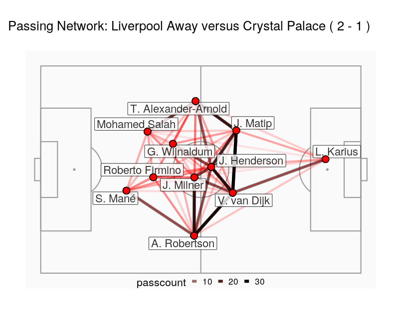

# Random Walks across Social Networks: The Markovian Movement of a Stochastic Soccerball

Association football is the world's most popular sport [@IPalacios-Huerta2004] and a multibillion dollar industry [@Deloitte2019]. 
Statistical analysis of the sport was pioneered more than fifty years ago [@CReepBenjamin1968], but has only recently begun to make a more widespread impact [@PCintiaEtAl2015]. Such analysis is of potential interest to coaches and scouts working professionally within the game, journalists and media commentators explaining the game, and gamblers and bookmakers putting money on the game. In this paper I build upon previous work applying Social Network Analysis [@TGrund2012] and Markov Modelling [@JPena2014] to football data, and introduce an original method for quantifying the contribution of each player to a team's goal-scoring capability.

