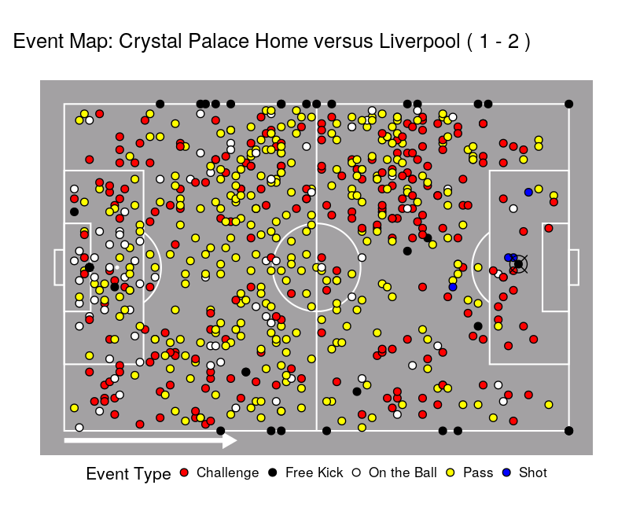
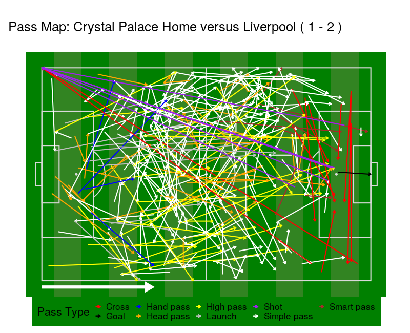

## Executive Summary

## Introduction

@RPollardReep1997
@RPollard2002
@RPollardEtAl1988
@CReepBenjamin1968
@CReepEtAl1971

even earlier @JEaves2015

David Barrett [@ECochraneEtAl1910]

## Data

dataset
@LPappalardoEtAl2019a

nested JSON

- load JSON
- decode the 'tags', player IDs and team IDs.
- unpack the location and target positions.
- distinguish play sequences, as indicated by a 'Free Kick' (includes Throw-in) or a 'Goal'.
- distinguish possession sequences
- include starting XI and Home/Away status info
- convert time-stamp in seconds to classic minutes

load into R, test that league table given by preprocessed data matches actual results. Table 1
- found that De Bruyne's goal was misclassified as an inaccurate pass, rather than a goal-scoring shot.

Table 1
Premiership Top 5

Initial exploratory visualizations:

- points showing events in a match for home and away team

Figure 1a,b

Figure 2a,b
- arrows showing passes and shots

More specifically: we consider a specific possession sequence to check that our preprocessing strategy has been successfuly.
Table 2: Events of Possession Sequence
Figure 3: Pitchmap showing Possession Sequence

Figure 4: YouTube Clip showing successful conclusion of possession sequence

## Methodology

### Graph Theory Definitions

*Social network analysis* uses the tools of mathematical graph theory to analyse social structures. We therefore begin by defining several necessary theoretical terms.

A *graph* is an ordered tuple $G = (V,E)$, consisting of a set of *nodes* (or *vertices*) $V = \{v_{i}\}$, and a set of *edges* $E = \{e_{ij}\}$, where the edge $e_{i,j}$ is the ordered pair $(i,j)$ representing some connection from the *source* $v_{i}$ to the *target* $v_{j}$. 

Two nodes connected by an edge are said to be *adjacent* to each other. An edge $e_{ii}$ connecting a node $v_{i}$ to itself is called a *loop*; the node is then *self-adjacent*.

A graph is *undirected* if $e_{ij} \iff e_{ji}$ -- otherwise it is *directed*. It is a *simple* graph if the edges are distinct and unrepeated -- otherwise it is a *multigraph*. 

Given a graph G, we can describe a *walk* of length L as a sequence of adjacent (but not necessarily distinct) nodes $(v_{0},...,v_{L})$; or, equivalently, as a sequence of edges $e_{0,1},...,e_{L-1,L}$. Conversely, given a set of walks, we can construct the (minimal) underlying graph containing all the nodes and edges involved in the walks.

A graph is *weighted* if there exists some function $w: E \mapsto \mathbb{R}$ assigning a weight value to each edge. 

An unweighted multigraph can thus be viewed as a weighted simple graph by defining $w(e_{i,j}) = |\{e \in E: e = e_{i,j}\}| \in \mathbb{N}_{0}$, so that the weight of an edge is the number of times it is repeated. 

A weighted simple graph can be uniquely described by an *adjacency matrix*:
$$
M_{ij} = \begin{cases}
    \begin{array}{ll}
         w(e_{i,j}), & e_{i,j} \in E \\
       0, & \mathrm{otherwise}
    \end{array}
\end{cases}
$$

There are then a large variety of different graph metrics which can be calculated, including in particular an ever-increasing number of measures of *centrality*.

### Graph Theory Application

We consider the possession sequences of a football match as *walks* of the football across a social graph in which the nodes are players (considered either individually or collectively), and the connecting edges are defined by the movement of the ball, as it travels from player to player. We can then construct the underlying multigraph for any particular possession sequence (as in Figure i), or indeed for the whole game.

Figure 5

There are several different 'weights' we could assign an edge: the Euclidean distance moved by the ball; the polar angle; the time interval. However, for this particular analysis we ignore the spatial dynamics and the subtler aspects of continuous time, and focus on the network connections between players.

We do not restrict our analysis to actual passes but include touches on the ball, challenges, and shots. Regardless of the type of event, we consider any movement of the ball from player $U$ to player $V$ as an edge $e_{U,V}$, including the loop $e_{U,U}$ where the player dribbles with the ball. As suggested above, we let the weight of the edge $e_{U,V}$ be the number of times the ball moves from player U to player V. We can then generate the adjacency matrix for a team in a particular match.

Figure 6

It is increasingly common [@TKnutson2018] to visualize a possession network by positioning each node according to the mean location of the player's touches, and varying the appearance (width, colour or transparency) of the edges to show the frequency of that pass. This swiftly communicates a team's formation, and gives a qualitative sense of a team's strategy. However, visualizing the mean position of a player could be misleading: if a player always plays on the wing, but is switched half-way through the game from one side of the pitch to the other, his 'average position' will be central, although he may never have touched the ball centrally. It is also not possible in a static image to distinguish a pass $e_{U,V}$ from its reverse $e_{V,U}$. @KSingh2018 therefore suggests creating interactive visualizations in which the user can adjust the weighting to highlight forward or backwards passes as desired.

Figure 7

### Probability and Statistics

We then also need some definitions from *probability theory* and *statistics*. [@RSerfozo2009a]

A *sample space* $\Omega = \{\omega_{i}\}$ is the set of possible *outcomes* of an *observation*. If we are observing who has the ball, then the sample space is the set of players on the pitch. An *event* $F$ is some subset of $\Omega$, and the *event space* $\mathcal{F}$ is the set of subsets of $\Omega$. In particular, $\Omega \subset \mathcal{F}$. 

To illustrate the difference between the sample space and the event space, we could observe whether the *home team* is in possession of the ball. The outcome of observing who has the ball will not be a whole team, but merely some particular player $\omega_{x}$, whom we could call $h_{x}$ if he is on the home team, or $a_{x}$ if he is on the away team. So our sample space $\Omega = \{\omega_{i}\} = \{h_{i}\} + \{a_{i}\}$, and the *event* that the home team has possession $H = \{h_{i}\} \in \mathcal{F}$.

A *probability* $\mathbb{P}$ is then a function $\mathbb{P}: \mathcal{F} \mapsto [0,1] \in \mathbb{R}$, such that $\sum\limits_{\omega_{i} \in \Omega}\mathbb{P}(\omega_{i}) = 1$ and $\mathbb{P}(\O) = 0$. We can also talk about the *conditional probability* of an event $X$ given another event $Y$, which we write $\mathbb{P}(X | Y)$.

A *random variable* is a function $X: \Omega \mapsto S$. If $S \subseteq \mathbb{R}$ then we also have the *expectation* $\mathbb{E}[X]$ and *variance* $\mathrm{Var}[X]$, but it is acceptable to have an $S \not\subset \mathbb{R}$. Again, to illustrate what we mean -- the number of goals in the match could be considered as a random variable, but so could our previous question of which player has the ball at a particular time.

A *stochastic process* is an indexed set (that is, a *sequence*) of random variables, where the index commonly refers to points in time $t \in T$, which may be considered discretely (so $t \in \mathbb{N}_{0}$ ) or continuously (so $t \in \mathbb{R}_{ \ge 0}$ ). The range $S$ of a stochastic process $\{X(t,\omega):t\in T,\omega \in \Omega\}$ is called its *state space*, and the value $X_{t}$ is its *state* at time $t$.

A stochastic process has the *Markov property* if $\forall t \ge 0, \mathbb{P}(X_{t+1}=s| X_{0},...,X_{t}) = \mathbb{P}(X_{t+1}=s| X_{t})$; this means that future states are dependent only on the present state, regardless of the previous history of past states. Such a process can be called a Markov process, and we call the probability $\mathbb{P}(X_{t+1}=s_{j}|X_{t}=s_{i})$ the *transition probability* $p_{ij}$ .

A Markov process is *time-homogenous* if the transition probabilities stay constant through time, ie. $\mathbb{P}(X_{n+1}=s|X_{n}) = \mathbb{P}(X_{m+1}=x|X_{m}) \forall m,n \in T$. If $S$ is countable, then the probability distribution of such a process can be described by its initial *distribution vector* $\pi_{0}$ and its *transition matrix* $P$, where each $i$th row is made up of the transition probabilities $p_{ij}$ and $\sum\limits_{j} p_{ij} = 1 \forall i$. Specifically, after $k$ transitions we have the distribution $\pi_{k} = \pi_{0}P^{k}$.

If a Markov process develops in discrete time and takes a values from a discrete state space, then we call it a *Markov chain* and can straightforwardly draw it as a weighted simple graph by treating its transition matrix as an adjacency matrix. Conversely, we can transform an adjacency matrix $M$ into a transition matrix $P$ by defining the elements $p_{ij} := \frac{m_{ij} }{\sum\limits_{j}m_{ij}}$, so that each row sums to 1 as required. We can then picture the development of a Markov process as a *random walk* on the graph defined by its transition probabilities, noting that since the transition probabilities are not uniform this walk is *biased*.

Figure 8

In Figure 8 we show the heatmap of the Transition Matrix derived from the Adjacency Matrix shown in Figure 6. There we showed only the adjacency counts for the starting eleven, but now we include the subsitutes, as well as treating the 'Opposition' collectively as a single node. Most significantly, we now include a 'Goal' as a node. In every other case where the ball goes out of play, we ignore the details of whether it was for a corner, throw-in, offside, or foul, and simply consider the ball to have moved from whichever player had the ball to the opposition. (Consequently, the players which the Adjacency Matrix indicates get the ball most often from the opposition are generally full-backs who take throw-ins, rather than players whose challenges are actually winning the ball, as one might initially suppose). But a goal is of unique significance, and for a social network analysis of football to be anything more than a diverting curiosity, we need to be able to say something meaningful about what a team's possession graph tells us about the likelihood of goals.

To do this, as we have said, we treat a goal as a node in its own right; in particular, in the terms of Markov theory, we treat it as an *absorbing state*. Clearly a football match continues after a goal is scored, but from the perspective of our model, the match is considered as a series of stochastic processes which end and immediately start anew if and when a goal is scored.

This allows us to calculate the expected *hitting time* of a goal, given that any particular player has the ball. 

The hitting time $\tau_{R}$ of some state(s) $R \subset S$ is given by $\tau_{R} = min\{ t \ge 0 \colon X_{t} \in R \}$.

### Statistical Application
The extent of a sample space depends very much on the nature of its corresponding observation: if we are observing who has the ball at a particular moment, then the sample space will consist of the players; if we are considering 

## Results

## Conclusion

## Bibliography
