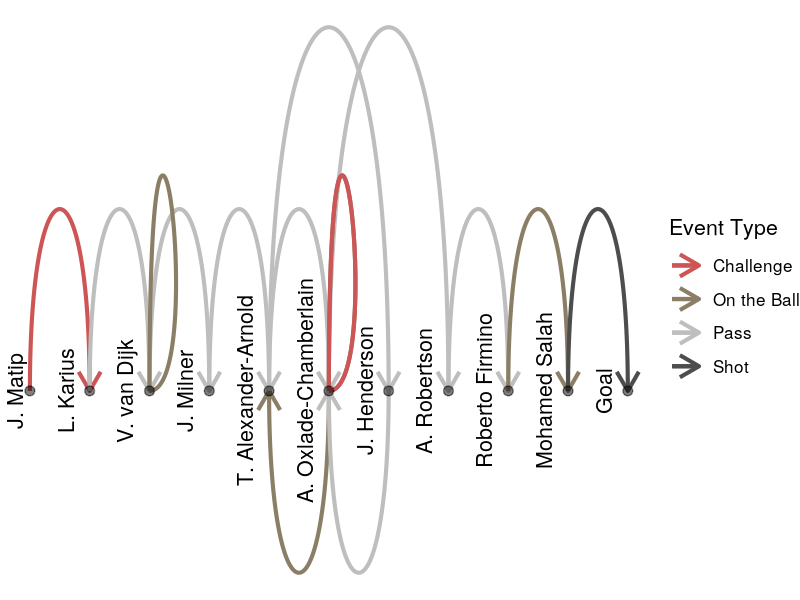

## Executive Summary

Association football is the world's most popular game and a multibillion dollar industry. Statistical analysis of the sport was pioneered more than fifty years ago, but has only recently begun to make a more widespread impact. In this paper I explain how Social Network Analysis can provide the tools to model a football team's ball-possession as a dynamic probabilistic system, and hence how we can quantify the effect of each player on the team's goal-scoring capability.

## Introduction

After thirty years of waiting, Liverpool F.C. are once again English champions [@BBC2020]. But while manager Jurgen Klopp is now guaranteed his place in footballing folklore, less well known is the name of data scientist Ian Graham, whose analysis led to Klopp being hired in the first place [@BSchoenfeld2019], and whose research team is regarded as "the strongest of its kind in English football" [@SAustin2020].

In this paper, I develop a rigorous account of a football match as a stochastic social network, the graph of which is generated by the movement of the ball from player to player. I then show how the adjacency matrix of a player, considered as a node in a football match's possession sequence graph, can be used to quantify his contribution to the likelihood of the team scoring. Finally, I discuss the potential and pitfalls of this new metric, which I call *Relative Markovian Expected Goals*.

## Data

### JSON Event-logs

The dataset is provided by WyScout, one of a growing number of companies in the football analytics industry, and is available from FigShare.com [@LPappalardoMassucco2020]. It includes more than three million *event-logs* for every match from the five major European leagues, in JSON format (see Figure 1), with  the details of players, teams, and informative tags (such as the crucial 'Goal') numerically encoded. Each event is associated with an event type (such as 'Shot', 'Pass' or 'Free Kick'), identified with a player, and includes a nested array of the locational *positions* of the event itself and its target.

### Preprocessing

I used Python to convert this into a *tidy* dataframe [@HWickham2014], that could then be analyzed and visualized using R. For the sake of reproducible research, all code is attached as appendices, as well as available on Github. 

As part of this preprocessing stage I also labelled each event according first to its *in-play sequence*, and then its *possession sequence*. An in-play sequence ends when the ball goes out of play, as indicated by the subsequent event having the *eventName* 'Free Kick' (a category which includes throw-ins and corners, as well as actual free-kicks given for fouls or offsides); or by the final two events (the shot and the attempted save) being labelled with the *tag* 'Goal'. (Although every goal is followed by a 'free kick' from the centre of the pitch, this never seems to be included in the event logs, presumably because they are created from camera footage which focusses on the goal celebrations and tends to miss the immediate restart of play after a goal). 

Intuitively, to identify a possession sequence we should just be able to iterate through the event-logs of a given in-play sequence, and note when the team of the player changes. However, since the event-logs include challenges for the ball even when they are unsuccessful, this would lead to systematically undercounting the length of possession sequences. The solution I adopt is to iterate through the event-logs for a single team within an in-play sequence, paying close attention to the location data: if the location of an event is identical to the target-location of the previous event associated with that same team, then I treat is as part of the same possession sequence, otherwise I treat it as a separate sequence.

### Exploratory Visualization

We can then visualize the location of the event-log data points in the context of a diagrammatic football pitch, to allow for an immediate and accessible view of any particular possession sequence (eg. Table 2, Figure 3, Figure 4).

Figure 3: Pitchmap showing Possession Sequence

We can compare this to a tabulated account of all events from just before the beginning of the possession sequence until its end, we see that our algorithm has successfully handled the case where an opposition player's unsuccessful challenge interrupts the sequence of events associated with the team in possession.

Table 2: Events of Possession Sequence

And with possession sequences that end in a goal, it is generally possible to find video highlights of the events under consideration, and confirm that the data we have does correspond to what actually happened.

Figure 4: YouTube Clip showing successful conclusion of possession sequence

## Methodology

### Graph Theoretic Foundations

Social network analysis applies the concepts of mathematical *graph theory*.

A *graph* is an ordered tuple $G = (V,E)$, consisting of a set of *nodes* (or *vertices*) $V = \{v_{i}\}$, and a set of *edges* $E = \{e_{ij}\}$, where the edge $e_{i,j}$ is the ordered pair $(i,j)$ representing some connection from the *source* $v_{i}$ to the *target* $v_{j}$. 

Two nodes connected by an edge are said to be *adjacent* to each other. An edge $e_{ii}$ connecting a node $v_{i}$ to itself is called a *loop*; the node is then *self-adjacent*.

A graph is *undirected* if $e_{ij} \iff e_{ji}$ -- otherwise it is *directed*. It is a *simple* graph if the edges are distinct and unrepeated -- otherwise it is a *multigraph*. 

On an undirected graph, we call the number of edges connecting a node its *degree*; in a directed graph we distinguish between the *indegree* and *outdegree*.

Given a graph G, we can describe a *walk* of length L as a sequence of adjacent (but not necessarily distinct) nodes $(v_{0},...,v_{L})$; or, equivalently, as a sequence of edges $e_{0,1},...,e_{L-1,L}$. Conversely, given a set of walks, we can construct the (minimal) underlying graph containing all the nodes and edges involved in the walks.

A graph is *weighted* if there exists some function $w: E \mapsto \mathbb{R}$ assigning a weight value to each edge. 

An unweighted multigraph can thus be viewed as a weighted simple graph by defining $w(e_{i,j}) = |\{e \in E: e = e_{i,j}\}| \in \mathbb{N}_{0}$, so that the weight of an edge is the number of times it is repeated. 

A weighted simple graph can be uniquely described by an *adjacency matrix*:
$$
M_{ij} = \begin{cases}
    \begin{array}{ll}
         w(e_{i,j}), & e_{i,j} \in E \\
       0, & \mathrm{otherwise}
    \end{array}
\end{cases}
$$

### Graphing a Team's Possession Network

We consider the possession sequences of a football match as *walks* of the football across a social graph in which the nodes are players (considered either individually or collectively), and the connecting edges are defined by the movement of the ball, as it travels from player to player. We can then construct the underlying graph for any particular possession sequence (as in Figure i), or indeed for the whole game.

Figure 5

There are several different 'weights' we could assign an edge: the Euclidean distance moved by the ball; the polar angle; the time interval. However, for this particular analysis we ignore the spatial dynamics and the subtler aspects of continuous time, and focus on the network connections between players.

We do not restrict our analysis to actual passes but include touches on the ball, challenges, and shots. Regardless of the type of event, we consider any movement of the ball from player $U$ to player $V$ as an edge $e_{U,V}$, including the loop $e_{U,U}$ where the player dribbles with the ball. As suggested above, we let the weight of the edge $e_{U,V}$ be the number of times the ball moves from player U to player V. We can then generate the adjacency matrix for a team in a particular match.

Figure 6

It is increasingly common [@TKnutson2018] to visualize a possession network by positioning each node according to the mean location of the player's touches, and varying the appearance (width, colour or transparency) of the edges to show the frequency of that pass. This swiftly communicates a team's formation, and gives a qualitative sense of a team's strategy.
Figure 7

### Probabilistic Walks on a Graph

To consider the team's ball-possession in its dynamic development, rather than merely as a static structure, we also need some definitions from *probability theory*.

A *sample space* $\Omega = \{\omega_{i}\}$ is the set of possible *outcomes* of an *observation*. If we are observing who has the ball, then the sample space is the set of players on the pitch. An *event* $F$ is some subset of $\Omega$, and the *event space* $\mathcal{F}$ is the set of subsets of $\Omega$. In particular, $\Omega \subset \mathcal{F}$. 

To illustrate the difference between the sample space and the event space, we could observe whether the *home team* is in possession of the ball. The outcome of observing who has the ball will not be a whole team, but merely some particular player $\omega_{x}$, whom we could call $h_{x}$ if he is on the home team, or $a_{x}$ if he is on the away team. So our sample space $\Omega = \{\omega_{i}\} = \{h_{i}\} \cup \{a_{i}\}$, and the *event* that the home team has possession $H = \{h_{i}\} \in \mathcal{F}$.

A *probability* $\mathbb{P}$ is then a function $\mathbb{P}: \mathcal{F} \mapsto [0,1] \in \mathbb{R}$, such that $\sum\limits_{\omega_{i} \in \Omega}\mathbb{P}(\omega_{i}) = 1$ and $\mathbb{P}(\O) = 0$. We can also talk about the *conditional probability* of an event $X$ given another event $Y$, which we write $\mathbb{P}(X | Y)$.

A *random variable* is a function $X: \Omega \mapsto S$. If $S \subseteq \mathbb{R}$ then we also have the *expectation* $\mathbb{E}[X]$ and *variance* $\mathrm{Var}[X]$, but it is acceptable to have an $S \not\subset \mathbb{R}$. Again, to illustrate what we mean -- the number of goals in the match could be considered as a real-valued random variable, and we could talk about the expectation and variation of the number of goals; but this is not the case for the question of which player has the ball at a particular time, though this also is a random variable.

A *stochastic process* is an indexed set (that is, a *sequence*) of random variables, where the index commonly refers to points in time $t \in T$, which may be considered discretely (so $t \in \mathbb{N}_{0}$ ) or continuously (so $t \in \mathbb{R}_{ \ge 0}$ ). The range $S$ of a stochastic process $\{X(t,\omega):t\in T,\omega \in \Omega\}$ is called its *state space*, and the value $X_{t}$ is its *state* at time $t$.

A stochastic process has the *Markov property* if $\forall t \ge 0, \mathbb{P}(X_{t+1}=s| X_{0},...,X_{t}) = \mathbb{P}(X_{t+1}=s| X_{t})$; this means that future states are dependent only on the present state, regardless of the previous history of past states. Such a process can be called a Markov process, and we call the probability $\mathbb{P}(X_{t+1}=s_{j}|X_{t}=s_{i})$ the *transition probability* $p_{ij}$ .

A Markov process is *time-homogenous* if the transition probabilities stay constant through time, ie. $\mathbb{P}(X_{n+1}=s|X_{n}) = \mathbb{P}(X_{m+1}=x|X_{m}) \forall m,n \in T$. If $S$ is countable, then the probability distribution of such a process can be described by its initial *distribution vector* $\boldsymbol{\alpha_{0}}$ and its *transition matrix* $\mathbf{P}$, where each $i$th row is made up of the transition probabilities $p_{ij}$ and $\sum\limits_{j} p_{ij} = 1 \forall i$. Specifically, after $k$ transitions we have the distribution $\boldsymbol{\alpha_{k}} = \boldsymbol{\alpha_{0}}\mathbf{P}^{k}$.

If a Markov process develops in discrete time and takes a values from a discrete state space, then we call it a *Markov chain* and can straightforwardly draw it as a weighted simple graph by treating its transition matrix as an adjacency matrix. Conversely, we can transform an adjacency matrix $\mathbf{M}$ into a transition matrix $\mathbf{P}$ by defining the elements so that each row sums to 1 as required:

$p_{ij} := \frac{m_{ij} }{\sum\limits_{j}m_{ij}}$

We can then picture the development of a Markov process as a *random walk* on the graph in which the nodes ${V}$ of the graph are the state space $S$ of the process, and the weights of the edges are the transition probabilities.

Figure 8

### Calculating Markovian Expected Goals

In Figure 8 we show the heatmap of the Transition Matrix derived from the Adjacency Matrix shown in Figure 6. There we showed only the adjacency counts for the starting eleven, but now we include the subsitutes, as well as treating the 'Opposition' collectively as a single node. Most significantly, we now include a 'Goal' as a node. In every other case where the ball goes out of play, we ignore the details of whether it was for a corner, throw-in, offside, or foul, and simply consider the ball to have moved from whichever player had the ball to the opposition. (Consequently, the players which the Adjacency Matrix indicates get the ball most often from the opposition are generally full-backs who take throw-ins, rather than players whose challenges are actually winning the ball, as one might initially suppose). But a goal is of unique significance, and for a social network analysis of football to be anything more than a diverting curiosity, we need to be able to say something meaningful about what a team's possession graph tells us about the likelihood of goals.

To do this, as we have said, we treat a goal as a node in its own right; in particular, in the terms of Markov theory, we treat it as an *absorbing state* which loops back on itself with certain probability. Clearly a football match continues after a goal is scored, but from the perspective of our model, the match is considered as a series of stochastic processes which end and immediately start anew if and when a goal is scored. This allows us to calculate the expected *hitting time* of a goal, given that any particular player has the ball. 

The hitting time $\tau_{s}$ of some state $s \in S$ is given by $\tau_{s} := min\{ t \ge 0 \colon X_{t} = s \}$, the earliest time at which the process reaches that state.  

Given an initial distribution $\boldsymbol{\alpha_{0}}$, we know that after $k$ transitions, the state $\boldsymbol{\alpha_{k}} = \boldsymbol{\alpha_{0}}\mathbf{P}^{k}$. 

We can define the *state vector* $\boldsymbol{\delta_{i}}$ of any particular state $s_{i}$ as
$$
\delta_{ij} := \begin{cases}
    \begin{array}{ll}
    	1, & i=j \\
	0, & \mathrm{otherwise.}
    \end{array}
\end{cases}
$$

The probability $\mathbb{P}(X_{k}=s_{i})$ is then given by the dot product $\langle \boldsymbol{\alpha_{k}}, \boldsymbol{\delta_{i}} \rangle$.

If $s_{i}$ is an absorbing state, then the probability that it is reached *for the first time* is given by $\pi_{k}:= \langle \boldsymbol{\alpha_{k}}, \boldsymbol{\delta_{i}} \rangle - \langle \boldsymbol{\alpha_{k-1}}, \boldsymbol{\delta_{i}} \rangle$. 

If the expectation of the hitting time is finite it can then be approximated directly by iterating up to some large $K$:
$$\mathbb{E}[\tau_{s}] = \sum_{k=0}^\infty k\pi_k \approx \sum_{k=0}^K k\pi_k$$ 

Thus we can quantify, for each player on the team, the expected number of events there will be before the team scores a goal. We invert this to give a measure of the expected number of goals; and scale it by the team's average number of events per game, we call this measure *Markovian Expected Goals* (MXG). We then scale this by the team's mean expected goals values to give a *Relative MXG* value, so that values can be compared fairly across teams to see which individual players contribute the most to their teams' goalscoring chances.

## Results

T

## Conclusion

## Bibliography
